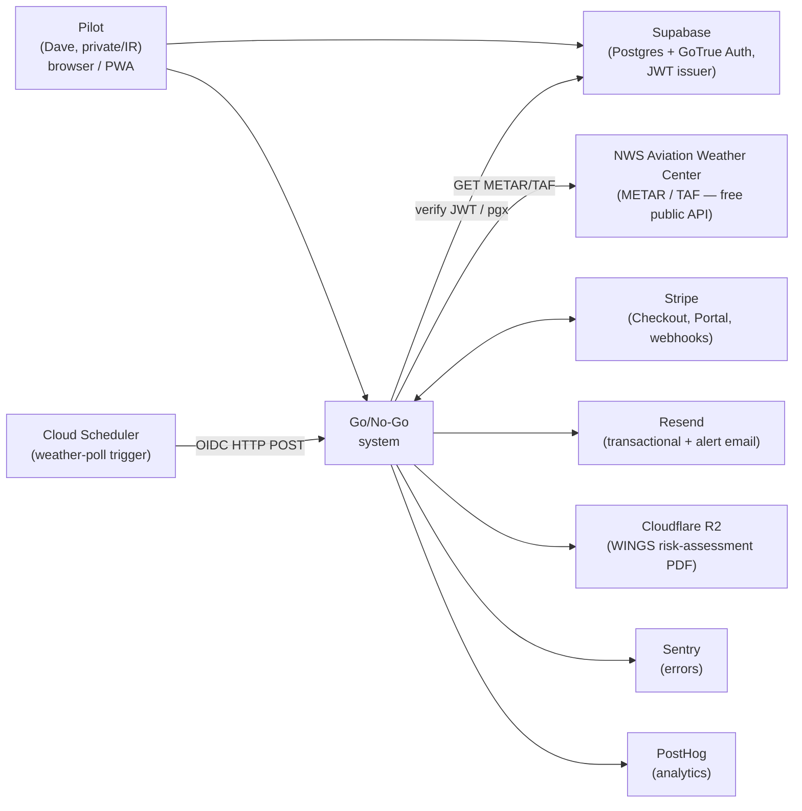
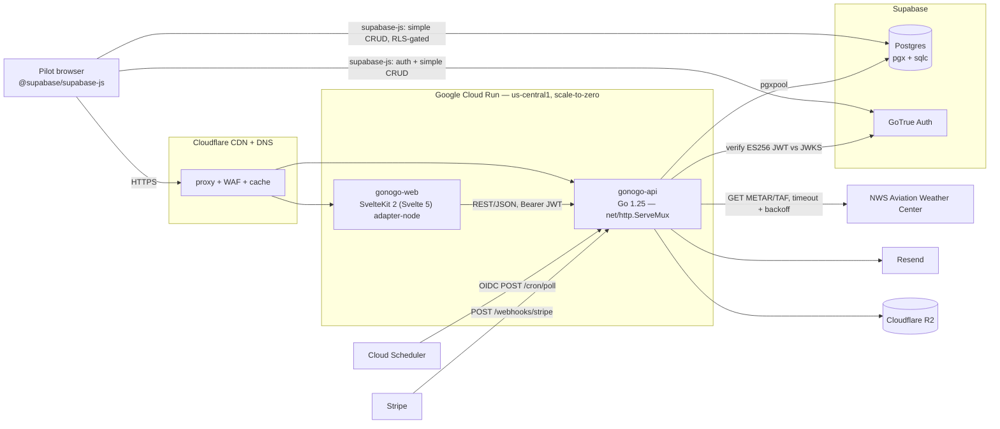

# 02 — Architecture

> **Status: DRAFT — awaiting founder review. No founder approval is
> recorded.** Discovery ([01-discovery.md](01-discovery.md)) defines what
> we're building; this file defines how it's wired together. Source of
> truth for stack choices: [docs/product-research.md](product-research.md)
> §2–§4 — this document refines that plan. The six ADRs it relies on
> ([0001](adr/0001-go-backend-for-weather-polling.md)–[0006](adr/0006-billing-model.md))
> are `Status: proposed`; Phase 2's first action on founder approval is
> to flip them to `accepted`.

## 1. System context (C4 L1)



External actors and systems:

- **Pilot (Dave)** — pays, saves a personal-minimums profile, runs
  verdicts, saves trips, generates WINGS PDFs.
- **Cloud Scheduler** — fires the weather-poll cron via an OIDC-authed
  POST on a fixed cadence.
- **Supabase** — Postgres (all app data) + GoTrue Auth (email/password,
  magic link, Google OAuth; ES256 JWT issuer). RLS is enabled.
- **NWS Aviation Weather Center** — the free public source of METAR/TAF.
  An **outbound** dependency: Go/No-Go calls it; it never calls us. A
  trust boundary and an availability dependency (ADR-0002).
- **Stripe** — Checkout, Customer Portal, billing webhooks.
- **Resend** — transactional email + the verdict-change alert fan-out.
- **Cloudflare R2** — server-generated WINGS risk-assessment PDFs.
- **Sentry / PostHog** — errors and analytics.

Out of scope for V1: no SMS provider, no Web Push, no native app, no
Python/ML service, no commercial weather feed, no flight-planning data.

## 2. Containers (C4 L2)

Go/No-Go is **two application runtime containers** on Cloud Run, plus
the browser runtime.



| Container          | Tech                                          | Responsibilities                                                                                                  | Trust boundary                     |
| ------------------ | --------------------------------------------- | ----------------------------------------------------------------------------------------------------------------- | ---------------------------------- |
| `gonogo-web`       | SvelteKit 2 (Svelte 5 runes), adapter-node    | SSR pages, auth UI, PWA shell, simple user-owned CRUD (browser-direct via supabase-js); proxies engine-backed calls to the API | Public HTTPS (Cloudflare-proxied)  |
| `gonogo-api`       | Go 1.25, stdlib `net/http.ServeMux`           | The NWS fetch + parser, the verdict engine, the weather-poll cron, WINGS-PDF generation, the Stripe/Resend webhook receivers, all privileged SQL | Public HTTPS; per-route auth (JWT / OIDC) |
| `browser`          | `@supabase/supabase-js` in the user agent     | Auth UI; simple CRUD on user-owned tables via PostgREST + RLS                                                      | RLS-gated (every query carries the JWT) |

### Why two containers

Per [ADR-0001](adr/0001-go-backend-for-weather-polling.md): Go/No-Go has
a third-party API integration (NWS), a scheduled weather poll with an
alert fan-out, a verdict-evaluation engine worth isolating as a pure
testable package, and server-side WINGS-PDF generation — four jobs a
request-driven SvelteKit-on-scale-to-zero runtime handles poorly. The Go
service owns those; the web tier keeps the UI and the simple CRUD.

### Internal modules within `gonogo-api`

```
backend/
  cmd/server/          → main(): resolve env → build deps → server.Run
  internal/
    server/            → net/http.ServeMux wiring, middleware chain
    auth/              → ES256 JWT verification (JWKS cached); OIDC verify
    weather/           → NWS Aviation Weather Center fetch client +
                         METAR/TAF parser. The trust boundary (ADR-0002).
    verdict/           → THE ENGINE — pure functions; (parsedWeather,
                         minimums, asOf) → Verdict. No clock/DB/IO inside
                         (ADR-0003). Never defaults to green.
    minimums/          → CRUD handlers for personal-minimums profiles
    trips/             → CRUD handlers for saved trips
    alerts/            → the weather-poll cron handler + the alert fan-out
    wings/             → server-side WINGS risk-assessment PDF generation
    billing/           → Stripe Checkout/Portal + the webhook receiver
    db/                → sqlc-generated queries + the pgxpool
      queries/         → *.sql source for sqlc
    ratelimit/         → in-process token bucket
    metrics/           → log-based metric emission helpers
```

The `verdict` package is the most heavily unit-tested in the repo and is
the one place comparison rules are implemented. The `weather` package is
the second — it owns the defensive METAR/TAF parser.

### Internal modules within `gonogo-web`

```
web/src/
  routes/
    (auth)/            → signup, login, magic-link/OAuth callback
    app/               → authenticated pilot UI: the verdict view,
                         minimums editor, saved trips, trip detail
    api/               → SvelteKit server routes — ONLY for paths that
                         need a server secret (Stripe Checkout/Portal
                         session creation) or that proxy an authenticated
                         call through to the Go API
    legal/             → terms, privacy, refund
  hooks.server.ts      → @supabase/ssr session; security headers
  lib/
    supabase.ts        → browser supabase-js client
    server/            → server-side supabase client, API proxy client
```

## 3. Critical flows

### 3.1 Signup + onboarding

```
Browser            Supabase Auth          gonogo-api
  │                     │                        │
  │ supabase.auth.signUp / signInWithOtp / OAuth │
  ├────────────────────►│                        │
  │ ◄── session ────────│                        │
  │                                              │
  │ first authenticated call (Bearer JWT)        │
  ├─────────────────────────────────────────────►│
  │                            verify ES256 JWT vs JWKS
  │                            lazy-create pilots row
  │                            if disclaimer_acked_at IS NULL
  │                              → 403 disclaimer_required {ack_url}
  │ ◄── onboarding redirect ─────────────────────│
  │
  │ onboarding: display name, home airport (optional),
  │             + the advisory-disclaimer checkbox
  │ POST /me/profile  → pilots row written, disclaimer ack persisted
```

### 3.2 The on-demand verdict (the hot path)

```
Browser                        gonogo-api                   NWS / Supabase
  │                                  │                          │
  │ POST /me/verdict                 │                          │
  │  { dep, dest, runway_heading }   │                          │
  ├─────────────────────────────────►│                          │
  │                          verify JWT → owner_user_id         │
  │                          validate airport identifiers       │
  │                          load the pilot's minimums profile  │
  │                          for dep + dest station:            │
  │                            check weather_observations cache │
  │                            on miss → NWS fetch (timeout,    │
  │                              User-Agent, backoff) ──────────►│ NWS
  │                            parse METAR/TAF (defensive)      │
  │                            cache by (station, issued_at)    │
  │                          verdict.Evaluate(weather, minimums, now)
  │                            ── PURE: no DB/clock/IO inside ──
  │                            ── never defaults to green ──────│
  │ ◄── { verdict, parsed weather, component math, detail,      │
  │       disclaimer } ─────────────────────────────────────────│
  │ render the verdict view (disclaimer on the verdict surface;
  │   "weather unavailable" if verdict == unknown)
```

The engine is a pure function (ADR-0003). If the NWS fetch fails or the
parse yields `parse_ok=false`, the verdict is `unknown` — the view shows
"weather unavailable", never green.

### 3.3 The weather-poll + verdict-change alert cron

```
Cloud Scheduler        gonogo-api                       NWS / Resend
  │                          │                                  │
  │ POST /cron/poll          │                                  │
  │  OIDC token              │                                  │
  ├─────────────────────────►│                                  │
  │                  verify OIDC (issuer=Google, aud=service URL)│
  │                  collect distinct airports of ACTIVE trips   │
  │                  for each station (deduplicated):            │
  │                    cache-aware NWS fetch (backoff) ──────────►│ NWS
  │                    parse METAR/TAF                           │
  │                  for each active saved trip:                 │
  │                    verdict := verdict.Evaluate(weather, ...) │
  │                    if verdict != trip.last_verdict:          │
  │                      INSERT alert_audit                      │
  │                        ON CONFLICT (saved_trip_id, user_id,  │
  │                          from_verdict, to_verdict,           │
  │                          observation_id) DO NOTHING          │
  │                        RETURNING id                          │
  │                      if row returned → Resend.send(alert) ───►│ Resend
  │                      else            → skip (already alerted)│
  │                    write verdict_snapshot; update trip       │
  │ ◄── 204 ─────────────────│                                  │
```

The UNIQUE constraint is the at-most-once contract (ADR-0004). Re-firing
the poll over the same observation is a safe no-op; a later, different
verdict transition legitimately alerts again. An unauthenticated POST →
401. The poll fetches only active-trip airports, station-deduplicated,
observation-cached (ADR-0005).

### 3.4 WINGS risk-assessment PDF

```
Browser           gonogo-api                          R2
  │                   │                                │
  │ POST /me/trips/:id/wings-pdf                        │
  ├──────────────────►│                                 │
  │            verify JWT → owner_user_id               │
  │            load the trip + its latest verdict_snapshot
  │              (both owner-scoped)                    │
  │            render the WINGS PDF — weather snapshot, │
  │              the pilot's minimums, the verdict, a   │
  │              PAVE-checklist section, the disclaimer │
  │            PUT the PDF to R2 under <user_id>/<...>  │
  │            record a wings_pdfs row                  │
  │            mint a signed GET URL (≤ 1h)             │
  │ ◄── { url } ──────│                                 │
```

The R2 key is prefixed per pilot and non-enumerable; the signed URL is
short-lived; the PDF carries the advisory disclaimer.

### 3.5 Stripe webhook → entitlement state

```
Stripe              gonogo-api                         Supabase
  │                       │                                │
  │ POST /webhooks/stripe │                                │
  │  raw body + signature │                                │
  ├──────────────────────►│                                │
  │              raw = request body bytes (NOT re-parsed)  │
  │              event = ConstructEvent(raw, sig, secret)  │
  │              BEGIN TX                                  │
  │              INSERT processed_webhook_events           │
  │                ('stripe', event.id, ...)               │
  │                ON CONFLICT (provider, event_id)        │
  │                DO NOTHING RETURNING id ───────────────►│
  │              if no row → replay → COMMIT, 200          │
  │              else → dispatch by event.type →           │
  │                mutate subscriptions                    │
  │              COMMIT                                    │
  │ ◄── 200 ──────────────│                                │
```

Signature on the raw body; idempotency is the `(provider, event_id)`
UNIQUE constraint; dedupe insert + mutation in one transaction.

## 4. Data model

Per [product-research.md §4](product-research.md#4-data-model-deep-dive)
— that section's DDL is the effective shape; the binding migrations are
written in Phase 5. Summary of the tables and their tenancy posture:

| Table                      | Owner / tenancy                                  | RLS posture                                                                 |
| -------------------------- | ------------------------------------------------ | --------------------------------------------------------------------------- |
| `pilots`                   | `user_id` = `auth.users.id`                      | own-read / own-write on `auth.uid()`                                        |
| `minimums_profiles`        | `owner_user_id` (default `auth.uid()`)           | own-read / own-write                                                        |
| `saved_trips`              | `owner_user_id` (default `auth.uid()`)           | own-read / own-write                                                        |
| `verdict_snapshots`        | `owner_user_id` (default `auth.uid()`)           | own-read / own-write                                                        |
| `wings_pdfs`               | `owner_user_id` (default `auth.uid()`)           | own-read / own-write                                                        |
| `airports`                 | **not user-owned — shared public reference**      | read-for-all (RLS off or a permissive read policy); writes are seed-only    |
| `weather_observations`     | **not user-owned — shared public cache**          | read-for-all; written by the backend's app-admin path                       |
| `alert_audit`              | `user_id` (the recipient)                        | own-read; written by the cron via the backend's app-admin path              |
| `subscriptions`            | `user_id`                                        | own-read; written by the Stripe webhook via the backend's app-admin path    |
| `processed_webhook_events` | (not user-owned)                                 | RLS denies all `authenticated` access; backend-only                         |

The most important tenancy distinction: `airports` and
`weather_observations` are **shared public data** — a METAR for KXYZ is
identical for every pilot — and are deliberately NOT RLS-scoped per
user. But a `verdict_snapshot` joins a public observation to a *specific
pilot's* minimums and saved trip, so it **is** user-owned and RLS-scoped.

### 4.1 Authorization model — two layers

1. **RLS (Layer 1).** Every user-owned table has `enable row level
   security` + own-read / own-write policies keyed on `auth.uid()`,
   created in the same migration as the table. Browser-direct
   `supabase.from(...)` calls fire these automatically. The shared
   public tables (`airports`, `weather_observations`) have a permissive
   read policy and are written only by the backend.
2. **Go-backend owner predicate (Layer 2).** The Go service verifies the
   Supabase JWT, derives `owner_user_id` from the `sub` claim, and scopes
   **every** user-data query by it. A saved trip, a minimums profile, a
   verdict snapshot, a WINGS-PDF record is never fetched by primary key
   alone. RLS stays enabled even on the backend path — belt and
   suspenders.
3. **The cron and the Stripe webhook** legitimately act on behalf of the
   system, not a single pilot. They use the backend's app-admin DB role
   deliberately; both paths are explicitly allowlisted and audited by
   `rls-and-tenancy-auditor`.

### 4.2 The single most important test

The cross-tenant regression test creates two pilots, writes pilot A's
data, then as pilot B asserts B reads zero of A's rows on every
user-owned table — through **both** the browser-direct path (anon
supabase-js → RLS) **and** the Go API path (B's JWT → owner predicate).
It is extended to the WINGS-PDF case: pilot B cannot fetch pilot A's PDF
via a guessed R2 key. If this test ever flakes, the suite halts.

### 4.3 The NWS trust boundary — input handling

`weather_observations` is a cache of data fetched from a third-party
public API. Per [ADR-0002](adr/0002-nws-aviation-weather-api.md), that
data is **untrusted**: the airport identifier is validated against a
strict ICAO/FAA pattern before the request URL is built; the response is
length-capped and content-type-checked; the METAR/TAF parser is
defensive (`parse_ok=false` on malformed input, never a panic, never a
guess); raw observation strings are stored and rendered as **text**,
never as HTML. The cache row carries no pilot identity, so it is not a
cross-tenant leak path.

### 4.4 Migration sequencing

`db/migrations/` holds sequential `golang-migrate` files shared by both
tiers. Tables land with their feature milestones (per
[04-plan.md](04-plan.md)): `pilots` + `airports` in M1;
`minimums_profiles` + `weather_observations` in M2; `saved_trips` +
`verdict_snapshots` + `alert_audit` in M4; `wings_pdfs` in M5;
`subscriptions` + `processed_webhook_events` in M6. CI runs `up →
down-all → up` on every migration PR; `sqlc diff` catches drift.

## 5. STRIDE threat model

Per trust boundary. Mitigations link to
[.claude/rules/security.md](../.claude/rules/security.md).

### 5.1 Browser ↔ gonogo-web

| Threat                            | Mitigation                                                                                                |
| --------------------------------- | --------------------------------------------------------------------------------------------------------- |
| **S**poofing (forged session)     | `@supabase/ssr` validates the auth cookie against Supabase per request (`safeGetSession` calls `getUser`) |
| **T**ampering (request body)      | Zod validation at every SvelteKit server endpoint; no `any`-shaped bodies                                 |
| **R**epudiation                   | Structured `pino` logger with request ID + hashed user ID on mutations                                    |
| **I**nformation disclosure (XSS)  | Svelte auto-escaping; no `{@html}` on user OR upstream content (a raw METAR is upstream-controlled); strict CSP, no inline scripts; HSTS; `frame-ancestors 'none'` |
| **D**enial of service             | Cloudflare WAF + DDoS at the edge                                                                         |
| **E**levation of privilege        | The web tier holds no privileged DB connection; privileged ops go to the API                              |

### 5.2 Browser ↔ Supabase (browser-direct CRUD)

| Threat                               | Mitigation                                                                                                          |
| ------------------------------------ | ------------------------------------------------------------------------------------------------------------------- |
| **S**poofing (forged JWT)            | Supabase verifies all JWTs server-side before RLS evaluation; ES256 + JWKS rotation handled by Supabase             |
| **T**ampering (RLS bypass)           | RLS keys on `auth.uid()` from the verified JWT, never on the request body; `owner_user_id` has `default auth.uid()` |
| **I**nformation disclosure (RLS bug) | The cross-tenant regression test is the gate; `rls-and-tenancy-auditor` reviews every migration                     |
| **D**enial of service                | Supabase free-tier rate limits; Cloudflare WAF in front of the proxied hostname                                    |
| **E**levation of privilege           | No anon-key access to `processed_webhook_events` or backend-only paths — RLS denies by default                     |

### 5.3 gonogo-web ↔ gonogo-api

| Threat                       | Mitigation                                                                                          |
| ---------------------------- | --------------------------------------------------------------------------------------------------- |
| **S**poofing                 | The web tier forwards the pilot's Bearer JWT; the API verifies ES256 against the JWKS               |
| **T**ampering                | TLS; the API re-validates every request body server-side                                           |
| **I**nformation disclosure   | The API scopes every query by the JWT-derived owner; no cross-tenant read possible                 |
| **D**enial of service        | In-process token bucket on the API; Cloudflare WAF at the edge                                     |
| **E**levation of privilege   | The API never trusts a `user_id` in a request body — only the verified JWT `sub`                   |

### 5.4 gonogo-api ↔ Supabase (pgxpool)

| Threat                         | Mitigation                                                                                         |
| ------------------------------ | -------------------------------------------------------------------------------------------------- |
| **S** (DNS hijack)             | TLS to the Supabase Postgres host; OS trust store                                                  |
| **T** (in-flight)              | TLS                                                                                                |
| **I** (creds leak)             | `DATABASE_URL` in Secret Manager; never logged                                                     |
| **D** (connection exhaustion)  | `pgxpool` sized to the Cloud Run instance concurrency                                              |
| **E** (over-privileged use)    | The app-admin path (cron, Stripe webhook) is allowlisted and `rls-and-tenancy-auditor`-enforced    |

### 5.5 gonogo-api ↔ NWS Aviation Weather Center (the third-party weather boundary)

This is the boundary research §3 warns about and ADR-0002 governs.

| Threat                            | Mitigation                                                                                                  |
| --------------------------------- | ----------------------------------------------------------------------------------------------------------- |
| **S** (a spoofed / MITM upstream) | TLS to `aviationweather.gov`; OS trust store; the response is parsed defensively regardless                 |
| **T** (a tampered / malformed response) | Length-capped + content-type-checked on ingest; the METAR/TAF parser degrades to `parse_ok=false`, never panics, never guesses |
| **R**                             | Each fetched observation is recorded in `weather_observations` with `fetched_at` + `raw_text`                |
| **I** (a malicious payload reaching the pilot) | Raw observation strings rendered as text only (Svelte escaping / `html/template`); never `{@html}` / `text/template`; never executed |
| **D** (the upstream is down / rate-limiting us) | **Graceful degradation** — the verdict becomes `unknown` ("weather unavailable"), never green; the fetch backs off on 429/5xx; the observation cache cushions short outages |
| **E** (an SSRF via a crafted airport identifier) | The airport identifier is validated against a strict ICAO/FAA pattern **before** the request URL is built — no raw user string in an outbound request |

**Availability dependency note:** the NWS API has no SLA and no paid
escape hatch. The mitigation for an outage is graceful degradation
(above) and being a well-behaved client — a descriptive `User-Agent`,
request batching, the observation cache, and 429/5xx backoff (ADR-0005)
— so Go/No-Go is never the client that earns a rate-block. A sustained
NWS outage is tracked as a launch-availability risk in
[04-plan.md](04-plan.md)'s risk register.

### 5.6 Cloud Scheduler ↔ gonogo-api (the weather-poll cron)

| Threat                          | Mitigation                                                                                          |
| ------------------------------- | --------------------------------------------------------------------------------------------------- |
| **S** (forged cron trigger)     | OIDC token verification — issuer = Google, audience = the Cloud Run service URL                     |
| **T**                           | TLS                                                                                                 |
| **R**                           | `verdict_snapshots` + `alert_audit` are the immutable record of every poll outcome and every alert  |
| **I** (PII in cron logs)        | The cron logs trip/observation UUIDs, station identifiers, verdict transitions — never email addresses |
| **D** (cron-triggered NWS burst)| OIDC gate; an unauthenticated POST → 401; in-process rate limit; the poll's own station dedup + cache bound the NWS request count |
| **E**                           | The cron uses the app-admin role deliberately and is the only scheduled path — narrowly scoped      |

### 5.7 gonogo-api ↔ Stripe / Resend

| Threat                     | Mitigation                                                                                          |
| -------------------------- | --------------------------------------------------------------------------------------------------- |
| **S** (forged webhook)     | Stripe signature on the raw body; Resend HMAC on the raw body; secrets in Secret Manager            |
| **T** (replayed webhook)   | `processed_webhook_events` UNIQUE `(provider, event_id)`; dedupe insert before mutation, one TX     |
| **I** (PII in logs)        | Webhook payloads not logged — only `event_id`, `event_type`, outcome                                |
| **D**                      | In-process rate limit on `/webhooks/*`                                                              |
| **E**                      | Webhook endpoints are inbound-only; Checkout/Portal session creation requires an authenticated JWT  |

### 5.8 gonogo-api ↔ Cloudflare R2

| Threat                     | Mitigation                                                                                          |
| -------------------------- | --------------------------------------------------------------------------------------------------- |
| **S / T**                  | TLS to the R2 endpoint; access keys in Secret Manager                                               |
| **I** (PDF leaks to another pilot) | R2 keys are prefixed per `user_id` and non-enumerable; reads are short-lived signed GET URLs minted owner-scoped; no public-bucket access |
| **D**                      | R2 free-tier limits; the only write path is the owner-scoped WINGS-PDF generation                   |
| **E**                      | The signed-URL minter validates the requesting pilot owns the `wings_pdfs` row before signing       |

## 6. ADRs in this phase

| ADR                                                                            | Status   | Summary                                                                          |
| ------------------------------------------------------------------------------ | -------- | -------------------------------------------------------------------------------- |
| [0001 Go backend service](adr/0001-go-backend-for-weather-polling.md)          | proposed | Go/No-Go gets a Go service — NWS integration, a poll cron, the engine, PDF gen    |
| [0002 NWS Aviation Weather API](adr/0002-nws-aviation-weather-api.md)          | proposed | The weather source is the free public NWS AWC API — a trust + availability boundary |
| [0003 Verdict engine pure function](adr/0003-verdict-engine-pure-function.md)  | proposed | The verdict engine is a pure function; it never defaults to green on missing data |
| [0004 Alert dedupe + email channel](adr/0004-alert-dedupe-and-email-channel.md)| proposed | Alert dedupe is a per-recipient per-transition DB UNIQUE constraint; channel is email |
| [0005 Weather-poll cadence + caching](adr/0005-weather-poll-cadence-and-caching.md) | proposed | One fixed-cadence cron, active-trip scope, observation cache by (station, issued_at) |
| [0006 Billing model](adr/0006-billing-model.md)                                | proposed | Stripe Checkout; $6/mo + $39/yr individual; 14-day trial; no free tier; no lifetime |

All six are `proposed`. **They become `accepted` only on founder
sign-off** — that is the first action of Phase 2 once this artifact is
approved.

## 7. Open questions for the founder

### Q1 — Ratify ADRs 0001–0006?

This architecture rests on six ADRs currently `proposed`. Approving this
Phase 2 artifact means ratifying them `proposed → accepted` and updating
[CLAUDE.md](../CLAUDE.md)'s load-bearing block to cite the ratified
state. Confirm.

### Q2 — Does the web tier proxy engine calls, or does the browser call the Go API directly?

Two viable shapes for the `web ↔ api` link: (a) the SvelteKit server
proxies authenticated calls to the Go API (the browser only ever talks
to `gonogo-web`), or (b) the browser calls the Go API directly with its
Bearer JWT (one fewer hop, but a second public origin + CORS).
**Recommended:** (a) — the SvelteKit server proxies. It keeps one public
origin, simplifies CORS and CSP, and lets the web tier add request
shaping. The latency cost of the extra same-region hop is negligible.
Confirm.

### Q3 — The `airports` reference-data source.

The `airports` table needs a US public-airport list (identifier, name,
lat/long, runway headings). Candidate public sources: the FAA's
published airport/runway data, or the OurAirports open dataset. Both are
public reference data (not a runtime third-party API, so not a free-tier
or licensing concern), but the choice affects the seed pipeline and how
runway headings are modeled.
**Recommended:** the OurAirports open dataset for breadth + an easy CSV
import, cross-checked against FAA data for runway headings; confirm in
Phase 3 before the seed migration. Confirm.

### Q4 — Carried from Discovery: the yellow-band definition (Q1), poll cadence (Q4).

The architecture assumes a small fixed caution buffer for the yellow
band and a single 30-minute poll cadence. If the founder decides
otherwise, the `minimums_profiles` buffer columns and the F-04 Cloud
Scheduler configuration shift. Confirm.

---

**Phase 2 status: DRAFT — not founder-approved.** Phase 3 (Spec) and
Phase 4 (Plan) draft artifacts exist alongside this one. Phase 2 is not
complete until the founder approves this artifact and ratifies the six
ADRs.
